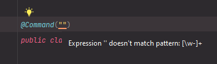

# \[Paper] Your First Command

## Prerequisites

* [getting-started.md](../getting-started.md "mention")
* [the-command-manager.md](../the-command-manager.md "mention")

## Creating the Command

Every command must be annotated with [`@Command`](https://github.com/JailGens/enchanted/blob/main/enchanted-api/src/main/java/net/jailgens/enchanted/annotations/Command.java). If you get an error, double check that you didn't accidentally use `net.jailgens.enchanted.Command`.&#x20;



```java
@Command("hello-world")
public class HelloWorldCommand {}
```



```kotlin
@Command("hello-world")
class HelloWorldCommand
```



If you have typed the command name in incorrectly, you should get a warning inside your IDE.

<figure><figcaption></figcaption></figure>

Now, simply create a method annotated with [`@Command.Default`](https://github.com/JailGens/enchanted/blob/main/enchanted-api/src/main/java/net/jailgens/enchanted/annotations/Command.java#L45) and inside print "Hello, world!"



```java
@Command("hello-world")
public class HelloWorldCommand {
    @Command.Default
    public void sayHelloWorld() {
        System.out.println("Hello, World!");
    }
}
```



```kotlin
@Command("hello-world")
class HelloWorldCommand {
    @Command.Default
    fun sayHelloWorld() {
        println("Hello, world!")
    }
}
```



All [`@Command.Default`](https://github.com/JailGens/enchanted/blob/main/enchanted-api/src/main/java/net/jailgens/enchanted/annotations/Command.java#L45)  tells enchanted is that the annotated method should run when the user executes the "hello-world" command without specifying any subcommand.

## Register the Command

Command registration is fairly simple, just call [`CommandManager.registerCommand(Object)`](https://github.com/JailGens/enchanted/blob/main/enchanted-api/src/main/java/net/jailgens/enchanted/CommandManager.java#L32) `` with the command you just created:



```java
public class YourPlugin extends JavaPlugin {
    public void onEnable() {
        PaperCommandManager commandManager = PaperCommandManager.create(this);
        commandManager.registerCommand(new HelloWorldCommand());
    }
}
```



```kotlin
class YourPlugin : JavaPlugin() {
    fun onEnable() {
        val commandManager = PaperCommandManager.create(this);
        commandManager.registerCommand(HelloWorldCommand());
    }
}
```



Now, simply start up your server, and see the output on console.
